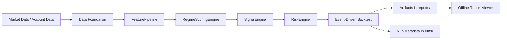

# xtrader

`xtrader` is a research-first quantitative trading project focused on Bitget data ingestion, feature computation, profile-driven strategy logic, event-driven backtesting, and offline report analysis.

## 1. Project Goals
- Provide a reproducible research pipeline: `Data -> Feature -> StrategyProfile -> Signal -> Risk -> Backtest`.
- Make strategy behavior explainable and traceable across config, parameters, diagnostics, and outputs.
- Enforce a disciplined delivery workflow through `spec/validation`.

## 2. Scope and Boundaries
Currently covered:
- Bitget historical kline/account-related access (client + unified data models).
- Feature Engine for technical indicators.
- Profile-driven strategy main path (`ProfileActionStrategy`).
- Runtime Core v1 (backtest-first) with structured artifacts.
- Offline Report Viewer for local analysis.

Not primary targets yet:
- Full live OMS/EMS execution loop.
- Full portfolio-level allocation and risk budgeting system.

## 3. Core Capabilities
- Exchange adapter: `xtrader.exchanges.bitget.BitgetClient`
- Unified models: `xtrader.common.models`
- Feature engine: `xtrader.strategies.feature_engine`
- Declarative strategy profiles: `xtrader.strategy_profiles`
- Signal and risk engines: `signal_engine` / `risk_engine`
- Event-driven backtest: `xtrader.backtests.event_driven`
- Runtime orchestration: `xtrader.runtime`
- Offline viewer tooling: `scripts/offline_report_viewer.py`

## 4. Main Architecture Flow
Profile strategy execution flow:
1. `FeaturePipeline` computes and organizes features.
2. `RegimeScoringEngine` outputs regime and score.
3. `SignalEngine` converts rules into action intent.
4. `RiskEngine` applies sizing / stop-loss / take-profit constraints.
5. `event_driven` executes backtest and emits standardized artifacts.



References:
- System architecture: [docs/01-project/system-architecture.md](docs/01-project/system-architecture.md)
- Runtime management: [docs/01-project/runtime-management.md](docs/01-project/runtime-management.md)

## 5. Repository Structure
```text
xtrader/
  src/xtrader/                 # core source code
  configs/                     # strategy/runtime configurations
  scripts/                     # runnable and utility scripts
  tests/                       # unit/integration tests
  docs/                        # project documentation
  reports/                     # local research/backtest outputs
  runs/                        # local runtime/perf/trial outputs
```

`reports/` and `runs/` are local runtime artifacts, not core source assets.

## 6. Documentation Entry Points
- Docs index: [docs/README.md](docs/README.md)
- Project-level docs: `docs/01-project/`
- Strategy requirements/discussions: `docs/02-strategy/`
- Delivery assets (`roadmap/specs/validation/backlog/templates`): `docs/03-delivery/`
- Operations skeleton: `docs/04-operations/`
- Agent collaboration/process/session notes: `docs/05-agent/`
- Historical archive: `docs/06-history/`

## 7. Quick Start

### 7.1 Environment
Requirements:
- Python `>=3.11`

Install (recommended dev mode):
```bash
pip install -e .
pip install -e ".[dev]"
```

Or with conda:
```bash
conda env create -f environment.yml
conda activate xtrader
```

### 7.2 Environment Variables
Copy and edit:
```bash
cp .env.example .env
```

Main variables:
- `BITGET_API_KEY`
- `BITGET_API_SECRET`
- `BITGET_PASSPHRASE`
- `BITGET_HTTP_PROXY` (optional)
- `BITGET_HTTPS_PROXY` (optional)

## 8. Common Commands

### 8.1 Bitget Client Demo
```bash
python examples/bitget_client_demo.py
```

### 8.2 Profile Precompile Check
```bash
PYTHONPATH=src python - <<'PY'
from xtrader.strategy_profiles import StrategyProfilePrecompileEngine

profile = "configs/strategy-profiles/five_min_regime_momentum/v0.3.json"
result = StrategyProfilePrecompileEngine().compile(profile)
print("status:", result.status)
print("error_code:", result.error_code)
print("error_path:", result.error_path)
PY
```

### 8.3 ProfileAction Smoke Backtest
```bash
PYTHONPATH=src python scripts/run_profile_action_backtest_smoke.py \
  --profile configs/strategy-profiles/five_min_regime_momentum/v0.3.json \
  --start 2026-01-01T00:00:00Z \
  --end 2026-01-15T00:00:00Z \
  --run-id 20260402T040000Z_profile_smoke_demo
```

### 8.4 Initialize Offline Viewer
```bash
python scripts/offline_report_viewer.py init
```

Then open:
- `reports/backtests/viewer/offline_report_viewer.html`

## 9. Output Conventions (`reports` vs `runs`)
- Strategy research outputs: `reports/backtests/strategy/...`
- Runtime orchestration/perf/trial outputs: `runs/...`

In short:
- Research and analysis -> `reports/`
- Runtime orchestration -> `runs/`

## 10. Testing and Quality Gates
Common tests:
```bash
PYTHONPATH=src pytest tests/unit
PYTHONPATH=src pytest tests/integration/test_bitget_client_live.py
```

Task guard flow:
```bash
python scripts/task_guard.py new <TASK_ID> --title "<title>"
python scripts/task_guard.py check <TASK_ID>
```

Workflow rules: [AGENTS.md](AGENTS.md)

## 11. Collaboration Workflow (Short Version)
1. Create task ID and spec/validation docs first.
2. Start coding only after requirement confirmation.
3. Record validation execution evidence after implementation.
4. Update session notes at the end of each session.

Details:
- `docs/05-agent/processes/task_development_process.md`
- `docs/05-agent/processes/spec_validation_process.md`

## 12. Version and Roadmap
- Current package version: `0.1.0` (see `pyproject.toml`)
- Milestones/tasks: `docs/03-delivery/roadmap/`
- Runtime Core v1 closure: `docs/03-delivery/specs/XTR-019.md`

## 13. Security Notes
- Never commit real API keys or sensitive account data.
- `.env` is ignored by `.gitignore`.
- Prefer SSH or PAT for repository access; avoid plaintext passwords.
