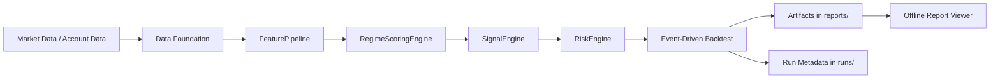

# xtrader

`xtrader` 是一个面向研究与回测的量化交易工程项目，当前聚焦于 Bitget 数据接入、特征计算、声明式策略配置、事件驱动回测与离线报告分析。

## 1. 项目目的
- 提供一条可复现的策略研发链路：`Data -> Feature -> StrategyProfile -> Signal -> Risk -> Backtest`。
- 让策略行为可解释、可追溯：每次运行都能定位配置、参数、诊断与产物。
- 统一研发流程：以 `spec/validation` 机制约束需求、实现与验证闭环。

## 2. 当前范围与边界
当前已覆盖：
- Bitget 历史 K 线与账户相关能力（客户端与模型抽象）。
- Feature Engine（多类技术指标计算）。
- Profile 驱动策略主链路（`ProfileActionStrategy`）。
- Runtime Core v1（backtest-first）与结构化运行产物。
- Offline Report Viewer（本地静态查看报告）。

当前不在主目标内：
- 完整实盘 OMS/EMS 执行闭环。
- 全量组合管理与组合级风险预算系统。

## 3. 核心能力
- 交易所接入：`xtrader.exchanges.bitget.BitgetClient`
- 统一数据模型：`xtrader.common.models`
- 特征计算：`xtrader.strategies.feature_engine`
- 声明式策略配置：`xtrader.strategy_profiles`
- 信号与风控引擎：`signal_engine` / `risk_engine`
- 事件驱动回测：`xtrader.backtests.event_driven`
- 运行时编排：`xtrader.runtime`
- 离线报告查看：`scripts/offline_report_viewer.py`

## 4. 架构主链路
主链路（Profile 策略）：
1. `FeaturePipeline` 计算并组织特征。
2. `RegimeScoringEngine` 输出状态与评分。
3. `SignalEngine` 依据规则生成动作意图。
4. `RiskEngine` 应用仓位与止损止盈等约束。
5. `event_driven` 回测执行并生成标准化产物。



参考文档：
- 系统架构：[docs/01-project/system-architecture.md](docs/01-project/system-architecture.md)
- 运行管理：[docs/01-project/runtime-management.md](docs/01-project/runtime-management.md)

## 5. 仓库结构
```text
xtrader/
  src/xtrader/                 # 核心代码
  configs/                     # 策略配置与 runtime 配置
  scripts/                     # 运行脚本、工具脚本
  tests/                       # 单元/集成测试
  docs/                        # 项目文档体系
  reports/                     # 策略研究回测产物（本地）
  runs/                        # runtime/perf/trial 产物（本地）
```

`reports/` 与 `runs/` 是本地运行产物目录，不是源码资产。

## 6. 文档导航
- 文档总入口：[docs/README.md](docs/README.md)
- 项目级文档：`docs/01-project/`
- 策略需求与讨论：`docs/02-strategy/`
- 交付资产（roadmap/specs/validation/backlog/templates）：`docs/03-delivery/`
- 运维骨架：`docs/04-operations/`
- Agent 协作流程与会话日志：`docs/05-agent/`
- 历史归档：`docs/06-history/`

## 7. 快速开始

### 7.1 环境准备
要求：
- Python `>=3.11`

安装（推荐开发模式）：
```bash
pip install -e .
pip install -e ".[dev]"
```

或使用 conda：
```bash
conda env create -f environment.yml
conda activate xtrader
```

### 7.2 环境变量
复制并填写：
```bash
cp .env.example .env
```

主要变量：
- `BITGET_API_KEY`
- `BITGET_API_SECRET`
- `BITGET_PASSPHRASE`
- `BITGET_HTTP_PROXY`（可选）
- `BITGET_HTTPS_PROXY`（可选）

## 8. 常用命令

### 8.1 Bitget 客户端示例
```bash
python examples/bitget_client_demo.py
```

### 8.2 Profile 预编译检查
```bash
PYTHONPATH=src python - <<'PY'
from xtrader.strategy_profiles import StrategyProfilePrecompileEngine

profile = "configs/strategy-profiles/five_min_regime_momentum/v0.3.json"
result = StrategyProfilePrecompileEngine().compile(profile)
print("status:", result.status)
print("error_code:", result.error_code)
print("error_path:", result.error_path)
PY
```

### 8.3 Smoke 回测（ProfileAction）
```bash
PYTHONPATH=src python scripts/run_profile_action_backtest_smoke.py \
  --profile configs/strategy-profiles/five_min_regime_momentum/v0.3.json \
  --start 2026-01-01T00:00:00Z \
  --end 2026-01-15T00:00:00Z \
  --run-id 20260402T040000Z_profile_smoke_demo
```

### 8.4 初始化离线报告查看器
```bash
python scripts/offline_report_viewer.py init
```

初始化后打开：
- `reports/backtests/viewer/offline_report_viewer.html`

## 9. 回测与运行产物约定
- 策略研究回测产物：`reports/backtests/strategy/...`
- Runtime 编排/perf/trial 产物：`runs/...`

一句话：
- 研究分析看 `reports/`
- 运行编排看 `runs/`

## 10. 测试与质量门禁
常用测试：
```bash
PYTHONPATH=src pytest tests/unit
PYTHONPATH=src pytest tests/integration/test_bitget_client_live.py
```

任务流程守门：
```bash
python scripts/task_guard.py new <TASK_ID> --title "<title>"
python scripts/task_guard.py check <TASK_ID>
```

流程约束见：[AGENTS.md](AGENTS.md)

## 11. 开发协作流程（简版）
1. 先建立任务 ID 与 Spec/Validation 文档。
2. 需求确认后再编码。
3. 实现后补齐验证执行记录。
4. 会话结束更新 `session-notes`。

详情：
- `docs/05-agent/processes/task_development_process.md`
- `docs/05-agent/processes/spec_validation_process.md`

## 12. 版本与路线图
- 当前包版本：`0.1.0`（见 `pyproject.toml`）
- 任务与里程碑：`docs/03-delivery/roadmap/`
- Runtime Core v1 收口：`docs/03-delivery/specs/XTR-019.md`

## 13. 安全说明
- 不要提交真实密钥或账户敏感信息。
- `.env` 已在 `.gitignore` 中忽略。
- 对外共享仓库时，优先使用 SSH 或 PAT，不使用明文密码。
